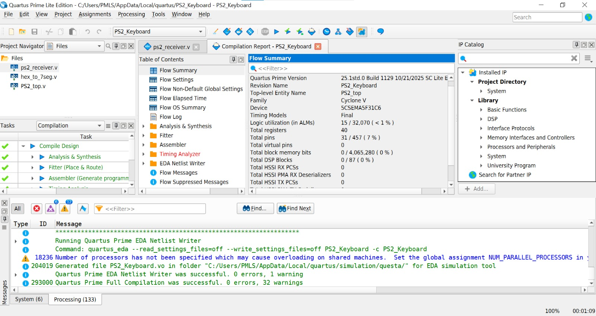
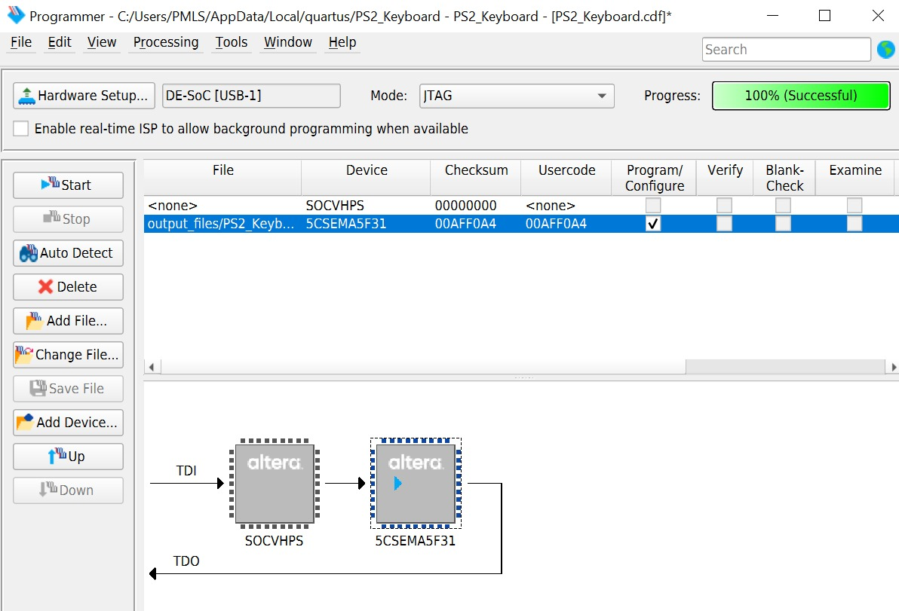
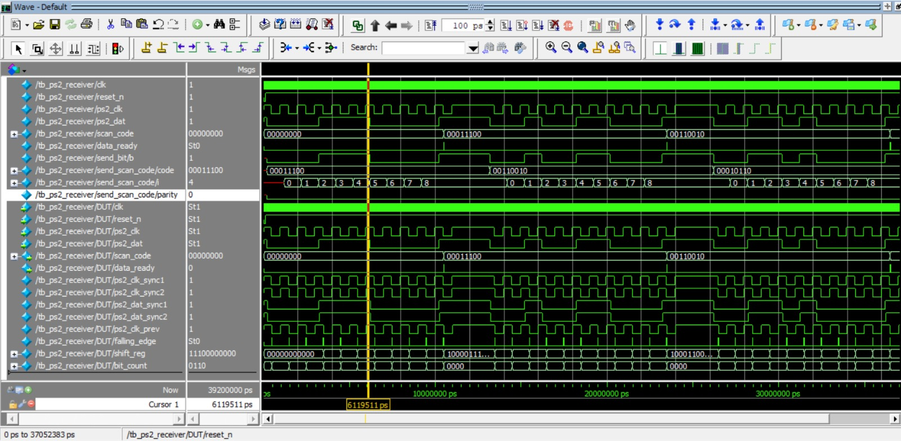

# PS2-Keyboard-DE1-SoC
# PS2 Keyboard Interface — DE1-SoC (Cyclone V)

A Verilog implementation of a PS/2 keyboard receiver for the Terasic DE1-SoC board.
Received scan codes are displayed live on the onboard 7-segment displays, with an
activity LED that toggles on every new key event.

## Features

- Synchronizes the raw `PS2_CLK` / `PS2_DAT` lines with a double-flop synchronizer
- Detects the falling edge of `PS2_CLK` (data is valid on the falling edge, per the PS/2 protocol)
- Shifts in the full 11-bit PS/2 frame (start bit, 8 data bits, parity bit, stop bit)
- Extracts and outputs the 8-bit scan code with a one-cycle `data_ready` pulse
- Displays the scan code in hex on `HEX0` (lower nibble) and `HEX1` (upper nibble)
- Toggles `LEDR[0]` on every new scan code received, as a visual activity indicator

## Repository Structure

```
├── src/
│   ├── hex_to_7seg.v      # 7-segment decoder (active-low segments)
│   ├── ps2_receiver.v     # PS/2 protocol receiver / scan code decoder
│   └── ps2_top.v          # Top-level module (DE1-SoC I/O connections)
├── sim/
│   └── tb_ps2_receiver.v  # Testbench for ps2_receiver (ModelSim)
├── quartus/
│   ├── PS2_Keyboard.qpf   # Quartus project file
│   └── PS2_Keyboard.qsf   # Pin assignments 
├── docs/
    └──Quartus_compilation.jpeg
    └──quartus_programmer_success.jpeg
    └──modelsim_waveform.jpeg    # Quartus compile reports & ModelSim waveform screenshots
└── README.md
```

## Hardware / Pin Assignments

Pin assignments are set for the **DE1-SoC (Cyclone V, 5CSEMA5F31C6)** board,
verified against the official DE1-SoC User Manual (Rev. F).

| Signal      | FPGA Pin  |
|-------------|-----------|
| CLOCK_50    | PIN_AF14  |
| KEY[0]      | PIN_AA14  |
| PS2_CLK     | PIN_AD7   |
| PS2_DAT     | PIN_AE7   |
| LEDR[0]     | PIN_V16   |
| HEX0[6:0]   | see `quartus/PS2_Keyboard.qsf` |
| HEX1[6:0]   | see `quartus/PS2_Keyboard.qsf` |

## How to Build (Quartus)

1. Open `quartus/PS2_Keyboard.qpf` in Quartus Prime
2. Add the source files from `src/` if not already listed
3. Run **Processing → Start Compilation**
4. Program the DE1-SoC via **Tools → Programmer** using the generated `.sof` file

## How to Simulate (ModelSim)

```tcl
vlib work
vlog src/hex_to_7seg.v src/ps2_receiver.v src/ps2_top.v sim/tb_ps2_receiver.v
vsim tb_ps2_receiver
add wave -r /*
run -all
```

The testbench drives synthetic PS/2 frames (start bit, 8 data bits LSB-first,
odd parity, stop bit) into `ps2_receiver` and checks that `scan_code` matches
the expected PS/2 Scan Code Set 2 values.

## Known Bug Fixed


An earlier version captured `scan_code` one falling edge too early, extracting
`shift_reg[8:1]` instead of `shift_reg[9:2]`. This produced a left-shifted,
MSB-dropped scan code (e.g. `A` = `0x1C` was read as `0x38`). Fixed by
correcting the bit range used at capture time.

## Results

Quartus compilation report, programmer, and ModelSim waveform screenshots are in
`docs/`.





## Demo Video

A short video of the design running on real DE1-SoC hardware (PS/2
keyboard scan codes shown live on the 7-segment displays) is included below.


https://github.com/user-attachments/assets/105ab8e1-b600-4865-a6e4-ba4acfd9815b


